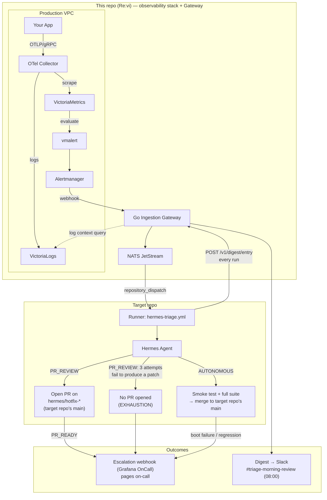

# Re:vi

Re:vi is a self-healing telemetry pipeline for teams too small to staff
round-the-clock on-call. Production alerts get triaged and patched overnight
by an AI agent ([Hermes](https://github.com/NousResearch/Hermes), agent-agnostic
via `REVI_AGENT_COMMAND`), and a human is only paged when a fix is ready to
review or something needs attention.

It runs in one of two modes, chosen per deployment based on how much you
trust your test suite:

- **`PR_REVIEW`** — Hermes diagnoses the crash, writes a fix and a sibling
  test, opens a PR on `hermes/hotfix-[alert-id]`, and pages the on-call
  engineer with a link. Nothing touches `main` without a human.
- **`AUTONOMOUS`** — Hermes does the same, then boots the app, runs synthetic
  smoke tests and the existing test suite, and only merges to `main` if
  everything passes. Failures abort, roll back, and page immediately.
  Successful runs are batched into a single digest posted to Slack each
  morning instead of paging in real time.

## Status

**V1 is complete.** The observability/alerting infrastructure, the Go
Ingestion Gateway, `hermes-triage.yml`, and the Hermes wrapper script all
exist and have been verified end-to-end — both `PR_REVIEW` and `AUTONOMOUS`
modes have live-tested runs (real `repository_dispatch` dispatches, real
PRs/merges, real pages) against the companion repo,
[`revi-hermes-target`](https://github.com/bookang869/revi-hermes-target),
which holds `hermes-triage.yml`, the Hermes wrapper, and fixture apps
standing in for "the production repo." The repair loop's gate now covers
Go, Rust, Node/TS, and Python — each with a build check, a lint pass
(`go vet`/`cargo clippy`/`eslint`/`ruff`), sibling-test-file enforcement,
and a test-quality check (the sibling test must fail against the pre-fix
code and only pass with the fix applied, catching a vacuous test that
would otherwise pass either way). Work has moved on to the rest of the
Phase 6 post-V1 backlog (re-provisioning a VPS, lock-refresh-while-active
testing, wiring in a real protected app, and more) — see
[`docs/PLAN.md`](docs/PLAN.md) for the full list.

[`docs/PRD.md`](docs/PRD.md) / [`docs/TRD.md`](docs/TRD.md) are living specs
and remain the source of truth whenever this README, `diagram.md`, or
`easy-workflow.md` disagree with them.

## How it fits together



The two subgraphs above are two different git repos: this repo hosts the
observability stack and Gateway; `hermes-triage.yml`, the Hermes wrapper, and
the app Hermes patches live in the companion
[`revi-hermes-target`](https://github.com/bookang869/revi-hermes-target) repo
(see Status above). The Gateway's `repository_dispatch` call reaches into
that repo's Actions; PRs and merges land on *its* `main`, not this repo's.

The Gateway (`gateway/`, a single Go binary) is one process with three jobs:

1. `POST /v1/alerts` — validates Alertmanager's native alert JSON, checks a
   NATS JetStream KV lock (dedupes flapping alerts), enriches with
   VictoriaLogs context, publishes to NATS.
2. An in-process NATS consumer that dequeues and fires GitHub's
   `repository_dispatch`, stamping the configured `REVI_MODE` into
   `client_payload`.
3. A cron goroutine that flushes the day's buffered digest to Slack
   `#triage-morning-review` at `REVI_DIGEST_TIME` (default 08:00).

`repository_dispatch` triggers `hermes-triage.yml` on a fresh, ephemeral
GitHub Actions runner in the target repo — that ephemeral clone *is* the
isolation boundary, there's no separate sandbox repo beyond it. The runner
invokes Hermes, verifies the patch (compile, smoke test, existing suite),
and either opens a PR or merges to the target repo's `main`, per the mode
above. Every run reports back to this repo's `POST /v1/digest/entry`
regardless of outcome.

For the full request/response schemas, token scoping, and NATS key design,
read TRD §2 and §4 before touching anything alert- or gateway-related — the
locking and token rules have constraints that aren't obvious from a
"reasonable-looking" implementation.

## Local stack

```
docker compose up -d
```

Brings up `otel-collector`, `victoria-metrics`, `victoria-logs`, `nats`
(JetStream), `vmalert`, `alertmanager`, `gateway`, and `tailscale` (Funnel
tunnel so the GitHub-hosted runner can reach `/v1/digest/entry`).

Requires a gitignored `.env` for the `gateway` and `tailscale` services'
secrets — copy [`.env.example`](.env.example) to `.env` and fill it in.
`REVI_WEBHOOK_SECRET`, `GITHUB_TOKEN_DISPATCH`, `REVI_GITHUB_OWNER`,
`REVI_GITHUB_REPO`, and `TS_AUTHKEY` are required (compose fails fast if
unset); everything else has a safe default. `REVI_WEBHOOK_SECRET` must match
`secrets/revi_webhook_secret` (Alertmanager reads the file, the Gateway
reads the env var — same secret, two consumers):

```
mkdir -p secrets
openssl rand -hex 32 > secrets/revi_webhook_secret
```

### Gateway (Go)

```
cd gateway
go build ./...              # compile
go test ./...                # run tests
go run ./cmd/server          # start the binary (needs REVI_WEBHOOK_SECRET set)
docker build -t revi-gateway .   # multi-stage build; what docker-compose builds too
```
